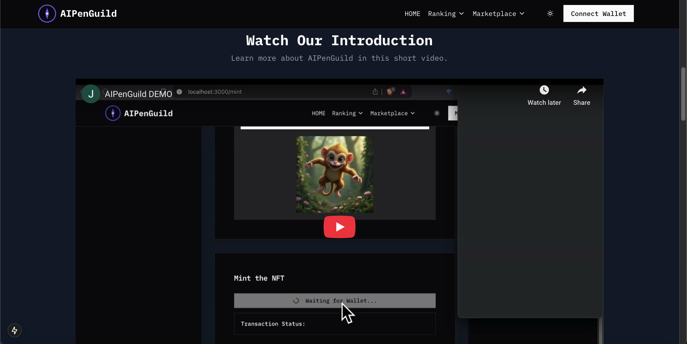

# AI Pen Guild

AI Pen Guild is a pioneering AI-driven NFT marketplace that empowers creators and collectors to mint, trade, and experience next-generation digital art.

## Team Members

- **Jade Laurence Empleo**  
  Solo Developer (Fullstack Developer, Blockchain Developer, UI/UX Designer)  
  **Contact Information:**  
  - Email: syntaxsurge@gmail.com
  - Discord: syntaxsurge
  - Telegram: syntaxsurge

## Development Guidelines

- **Fork the UI Template:**  
  [https://github.com/openguild-labs/dotui](https://github.com/openguild-labs/dotui)
- **Follow the Polkadot Brand Hub:**  
  [https://polkadot.com/community/brand-hub](https://polkadot.com/community/brand-hub)

## Project Description

### What Does Your Project Do?

AI Pen Guild is an innovative NFT marketplace that leverages advanced AI technologies to generate unique digital art and NFTs. The platform allows creators to mint AI-driven NFTs with randomized attributes and enables collectors to trade these digital assets in a seamless, user-friendly environment. It integrates blockchain technology with cutting-edge AI APIs to ensure authenticity and creativity in every NFT minted.

### Inspiration

Inspired by the limitless creative potential of artificial intelligence and the transformative power of blockchain technology, AI Pen Guild was envisioned as a platform where art and technology converge to redefine digital ownership.

## Technical Stack

- **Languages and Frameworks:**  
  React, Next.js, TypeScript, Solidity, Tailwind CSS
- **Blockchain/Protocol:**  
  Integrates with Polkadot and Ethereum testnets to demonstrate cross-chain NFT functionality.
- **Tools and APIs:**  
  Hardhat, Viem, Wagmi, Replicate API, RainbowKit, and Next Themes

## Features

- **AI-Driven NFT Minting:**  
  Generate unique NFT artwork and metadata using AI-based services.
- **Seamless Marketplace:**  
  List, buy, and sell NFTs on an intuitive and modern marketplace interface.
- **Integrated Reward System:**  
  Earn experience points (XP) and platform tokens through active participation and trading, incentivizing community engagement.

## How It Works

### Architecture

The platform features a modern front-end built with Next.js and Tailwind CSS, interfacing with smart contracts deployed on Polkadot and Ethereum testnets. AI service from Replicate generate NFT images, while blockchain interactions are handled via Viem and Wagmi. Additionally, a reward mechanism assigns XP to users based on their activity and NFT transactions.

### Demo Instructions

1. **Clone the Repository:**

   ```bash
   git clone https://github.com/syntaxsurge/AIPenGuild.git
   cd AIPenGuild
   ```

2. **Compile and Deploy the Smart Contracts:**
  Navigate to the contracts folder and read the dedicated README for instructions on how to install dependencies, compile, and deploy the contracts to a test network (e.g., Moonbase Alpha). You should do this before running the Next.js application if you want the site to function with live on-chain data.
  
  ```bash
  cd contracts
  npm install
  npm run compile
  npm run deploy:moonbase:log
  npm run update:addresses
  cd ..
  ```

3. **Install Front-End Dependencies (in the project root):**

  ```bash
  npm install
  ```

4. **Start the Development Server:**

  ```bash
  npm run dev
  ```

5. **Connect Your Wallet:**
  Use the integrated wallet connection to access the NFT functionalities (e.g., Metamask configured for Moonbase Alpha).

6.	**Mint and Trade NFTs:**
  Navigate to the minting page to generate AI-driven NFTs or upload your own images, then list them on the marketplace for trade. Have fun exploring the AI-driven NFT ecosystem!

## Challenges

I faced several challenges, including:
- Coordinating AI Image Generation with On-Chain NFT Creation.
- Ensuring a seamless cross-chain user experience.
- Designing a secure and scalable system.

Overcoming these challenges required deep dives into both blockchain and AI technologies, as well as extensive testing and optimization.

## Future Development

Planned enhancements include:
- Multi-network expansion & advanced AI integrations.
- Decentralized governance with community-driven updates.
- Enhanced gamification & XP-based unlockables.
- Expansion of reward pool for cross-chain grants.

## Submission Details

- **GitHub Repository:**
  [https://github.com/syntaxsurge/AIPenGuild](https://github.com/syntaxsurge/AIPenGuild)
- **Live Demo:**
  [](https://www.youtube.com/watch?v=MH4DsjtsO8c)
  [https://www.youtube.com/watch?v=MH4DsjtsO8c](https://www.youtube.com/watch?v=MH4DsjtsO8c)
- **Presentation Slides:**  
  [https://www.canva.com/design/DAGhvgXMfyQ/4wb7P2oUgSfPZp8zXUN8xA/edit?utm_content=DAGhvgXMfyQ&utm_campaign=designshare&utm_medium=link2&utm_source=sharebutton](https://www.canva.com/design/DAGhvgXMfyQ/4wb7P2oUgSfPZp8zXUN8xA/edit?utm_content=DAGhvgXMfyQ&utm_campaign=designshare&utm_medium=link2&utm_source=sharebutton)

## Acknowledgments

Special thanks to the Polkadot Community for their design guidelines, OpenGuild Labs for the open-source template, and all the open-source projects and mentors who provided invaluable guidance throughout this project.
